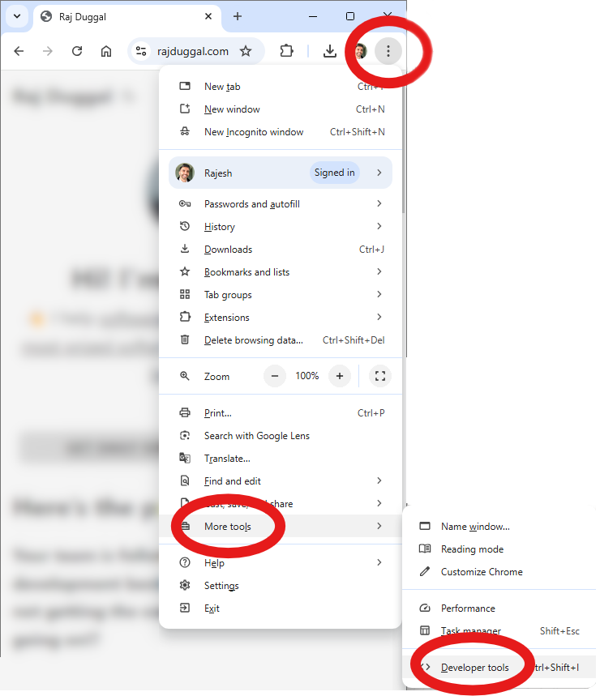
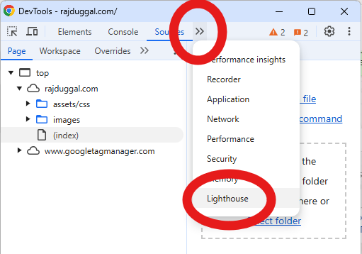
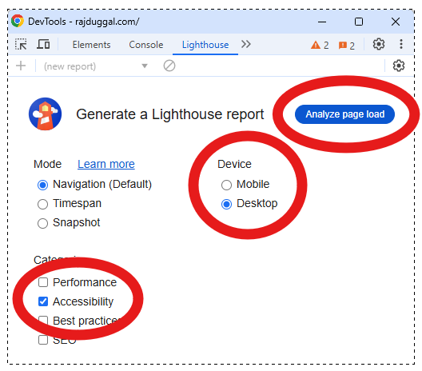
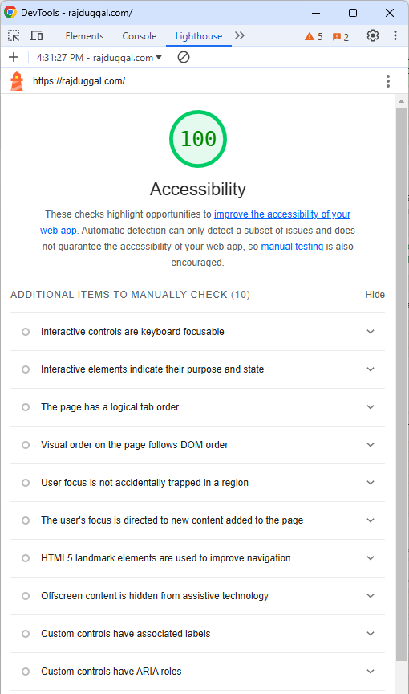

+++
title = "How to Run a Quick, Simple, Free, Web Accessibility Test Audit"
description = "You don't need to download or install special software. Your Chrome browser already has a built in free web Accessibility analysis and audit and reporting tool."
ShowPostNavLinks = false
author = ["Raj Duggal","Abi Vanniyasingam"]
hideMeta = false
[build]
    list = 'never'
+++

Chrome has a built in tool called [Lighthouse](https://developer.chrome.com/docs/lighthouse/overview) which can audit the web page you're visiting in both desktop browser and mobile browser modes.

## Step 1: Open the built in [Chrome Developer Tools](https://developer.chrome.com/docs/devtools)

* Open chrome
* In the top right corner, click the icon that contains a vertical column of three dots.
* Click "__More tools__".
* Click "__Developer Tools__".

## Step 2: Open the Lighthouse tab 

* Click the icon that contains two arrows pointing to the right.

* You will know that you on the "Lighthouse" tab, because it will be displayed in blue font with an underline. Like this...

## Step 3: Configure the test report

* Check the "__Accessibility__" checkbox.
* Uncheck the the other checkboxes.
* Choose to generate the report for either how the web page will be displayed in "__Desktop__" computer mode, or "__Mobile__" phone mode.
* Click the "__Analyze page load__" button, and it will start analyzing the web page and generate a report.

## Step 4: Enjoy the report!

Check your audit score. Did it score 100%?

Consider how you can make your web page more accessible!

There's plenty of resources online. And you can also [reach out to a web accessibility export like me!](https://clarity.fm/rajduggal/precall/free)

You can get more [information about how this report is generated and how the score is determined](https://developer.chrome.com/docs/lighthouse/accessibility/scoring).

